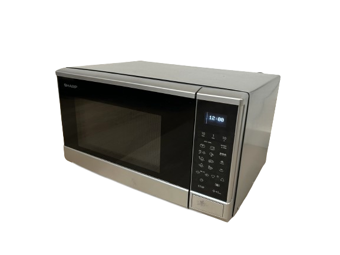
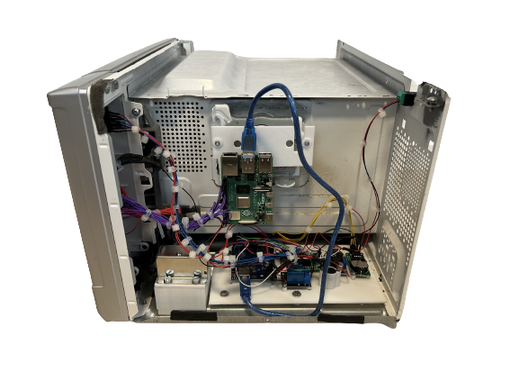
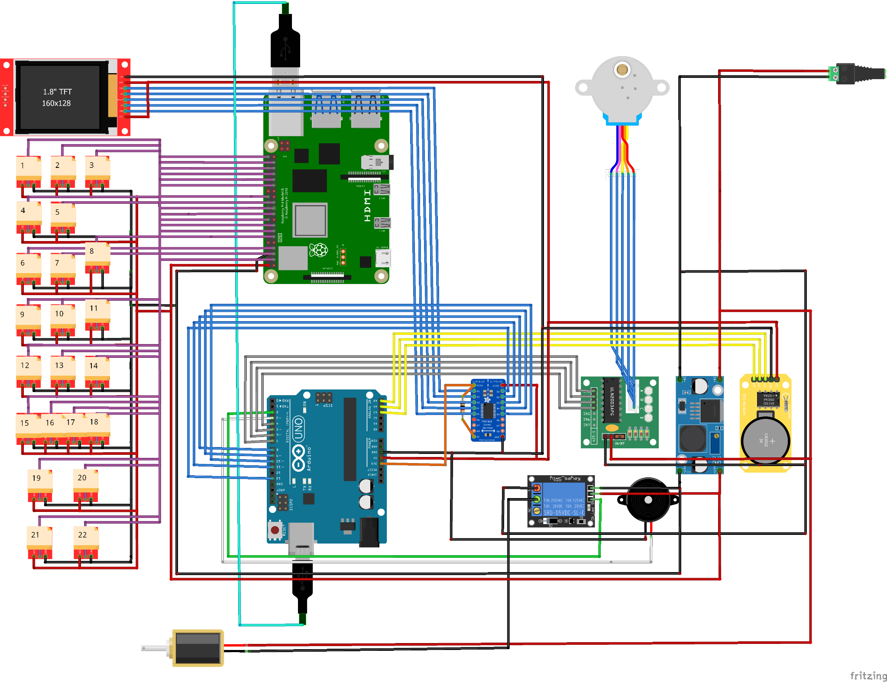
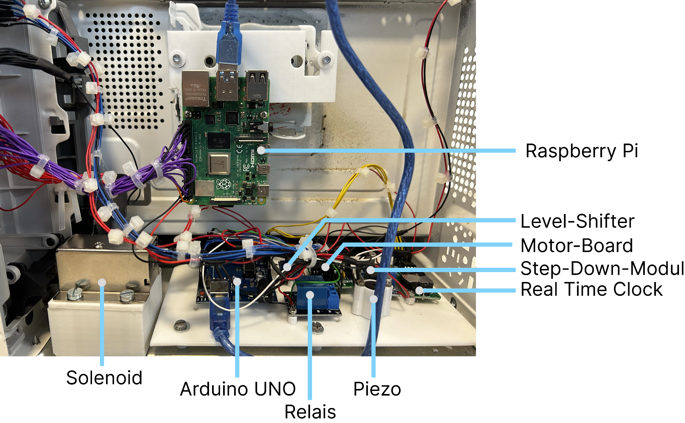
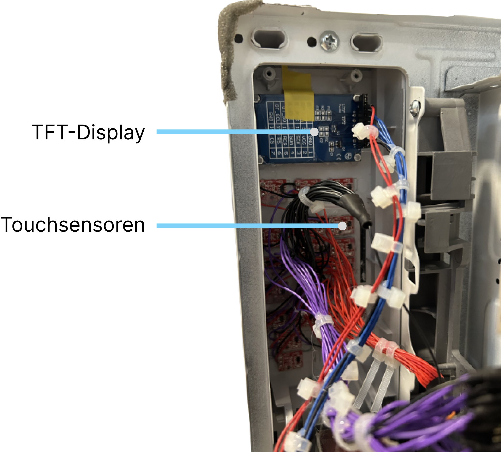

# Escape Room Microwave
> A game artifact for an Escape Room which looks just like a microwave.

  
&nbsp; &nbsp; &nbsp; &nbsp;
  

The microwave serves as a container of a clue in an Escape Room. This clue
should be located on the turntable. The microwave is locked during the game and can be opened by entering a correct key sequence via the touch control panel.
In the context of this Escape Room, the puzzle of the microwave builds on
the puzzle of a knife block: the sounds emitted by the knife block are to be matched with
the touch keys of the microwave - in this way the correct sequence of keys is to be discovered by one of the players.

## Dependencies
### Arduino
- [ArduinoRTClibrary](https://github.com/chrisfryer78/ArduinoRTClibrary)
- [Adafruit GFX](https://github.com/adafruit/Adafruit-GFX-Library)
- [Adafruit ST7735](https://github.com/adafruit/Adafruit-ST7735-Library)

### Raspberry Pi
- [paho-mqtt](https://pypi.org/project/paho-mqtt/)

## Hardware

